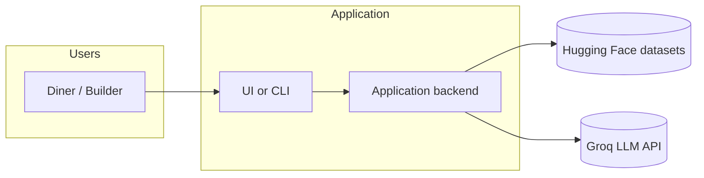
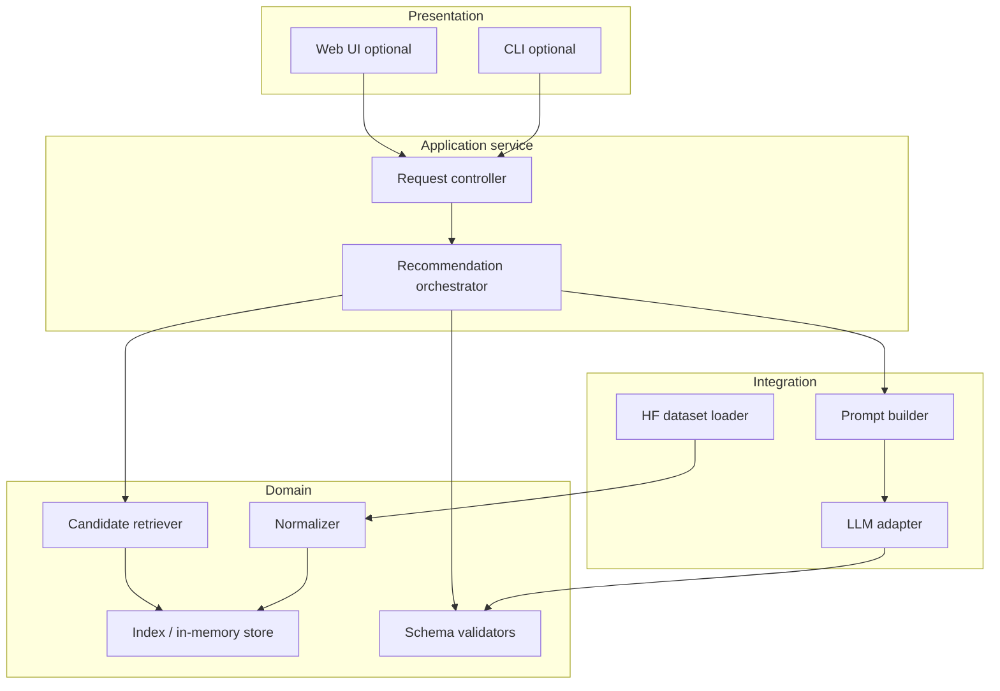
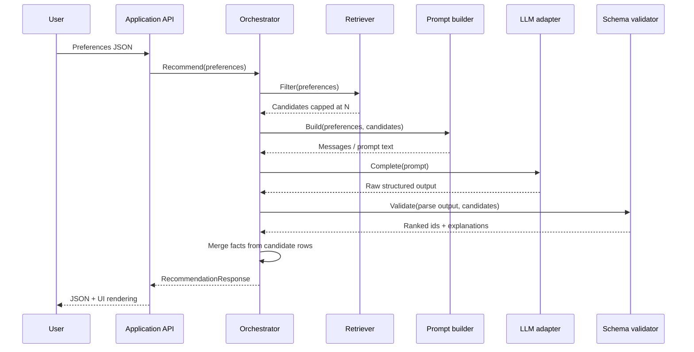

# Architecture

This document describes the **target system architecture** for the AI-assisted restaurant discovery application defined in [`problemStatement.md`](problemStatement.md). It is implementation-ready but **stack-neutral** where possible; concrete frameworks can map to these boundaries.

---

## 1. Alignment with the problem statement

| Problem statement objective | Architectural answer |
| --- | --- |
| Ingest Hugging Face dataset | **Data ingestion & normalization** pipeline; optional **local cache** after first load |
| Collect user preferences | **Presentation layer** (UI / CLI) + validated **preference schema** |
| Deterministic filtering | **Candidate retrieval** module — pure functions over normalized rows |
| LLM rank + explain, grounded | **Recommendation orchestrator** + **LLM adapter** with strict I/O contract |
| Render top picks | **Response model** mapped to UI/API; no invented fields |

Constraints from Section 6 ([`problemStatement.md`](problemStatement.md)) drive **grounding**, **secret handling**, and **quality** checks below.

---

## 2. Architectural principles

1. **Ground truth in data** — Restaurant facts (name, rating, cost, etc.) always originate from the dataset after normalization. The LLM never invents venues or numeric facts not present in the candidate payload.
2. **Separate concerns** — Filtering is deterministic and testable; LLM steps handle ordering and natural language only within guardrails.
3. **Bounded context for the model** — Candidate sets are **capped** (count and/or token budget) before the LLM call.
4. **Explicit contracts** — Preference input, candidate lists, and recommendation output use **versioned schemas** (JSON Schema or equivalent types) so parsers and prompts stay stable.
5. **Configurable secrets** — API keys and base URLs come from **environment variables** only.

---

## 3. High-level system context

External actors and systems:



- **One application boundary** owns ingestion, filtering, orchestration, and LLM calls (monolith is sufficient for this scope).
- **Optional split** later: static dataset snapshot served from object storage or CDN while keeping the same logical modules.

---

## 4. Logical layering

| Layer | Responsibility | Depends on |
| --- | --- | --- |
| **Presentation** | Forms / CLI for preferences; renders ranked list + explanations | Application API |
| **Application API** | Validates requests, invokes orchestrator, maps errors to HTTP or exit codes | Domain services |
| **Orchestration** | End-to-end flow: load or refresh index → filter → build prompt → call LLM → validate response | Retrieval, LLM adapter, schemas |
| **Domain / retrieval** | Normalized restaurant records, filter predicates, candidate caps | Normalized data store |
| **Data ingestion** | Download/load HF dataset, normalize types, dedupe if needed | HF SDK or HTTP |
| **Infrastructure** | HTTP client to LLM, logging, config loader | Env, secrets |

---

## 5. Component view



| Component | Description |
| --- | --- |
| **HF dataset loader** | Loads [ManikaSaini/zomato-restaurant-recommendation](https://huggingface.co/datasets/ManikaSaini/zomato-restaurant-recommendation); caches to disk optionally to avoid repeated downloads. |
| **Normalizer** | Maps raw columns to internal fields; coerces ratings and costs; fills defaults for optional attributes; tags unusable rows if critical fields missing. |
| **Index / store** | Holds normalized rows. For MVP: **in-memory list** or **embedded SQLite** keyed by stable id derived from row hash or dataset id. |
| **Candidate retriever** | Applies structured filters (location, budget band, cuisine, min rating, text match on “extras” if columns exist). Sorts deterministically for tie-breaking **before** LLM (e.g. rating desc, cost asc). Returns top-N capped at `MAX_CANDIDATES`. |
| **Prompt builder** | Serializes user preferences + candidate subset into a prompt with **explicit instructions**: only recommend from listed ids/names; explanations must reference supplied attributes. |
| **LLM adapter** | Single responsibility: send Groq OpenAI-compatible completion/chat request, handle retries/timeouts, return raw text or provider-native structured output. |
| **Schema validators** | Parse LLM output into `Recommendation[]`; reject or repair when IDs/names don’t match candidates (see Section 8). |
| **Recommendation orchestrator** | Composes retrieval → prompt → LLM → validate → enrich display fields from **original rows** (never trust model for numbers). |
| **Request controller** | HTTP routes or CLI command handler; input validation; maps to orchestrator. |

---

## 6. End-to-end data flow

### 6.1 Lifecycle: cold start vs. steady state

| Phase | Actions |
| --- | --- |
| **Startup** | Load cache if present; else run ingestion + normalization; build index. |
| **Steady state** | Serve recommendation requests using in-memory index (or reload on admin signal / TTL). |

### 6.2 Request flow (recommendation)



---

## 7. Data model (logical)

Exact fields follow the Hugging Face dataset. Internally, define a **canonical record** similar to:

| Field | Purpose |
| --- | --- |
| `id` | Stable internal identifier |
| `name` | Display name |
| `city` / `area` | Location filters |
| `cuisines` | Normalized list or single string for matching |
| `cost_for_two` or band | Budget mapping (low/medium/high per configurable thresholds) |
| `rating` | Numeric; compared to `min_rating` |
| `raw_attributes` | Additional columns for LLM context (address snippet, known tags, etc.) |

**Budget mapping** — Configuration table maps numeric ranges or dataset-specific enums to `{ low, medium, high }` so filters stay auditable.

---

## 8. LLM integration architecture

### 8.1 Responsibilities split

| Done by code | Done by model |
| --- | --- |
| Enforce hard filters | Rank within candidate list |
| Cap candidate count | Natural-language explanations |
| Attach factual fields to response | Optional short comparative summary |
| Reject hallucinated restaurants | — |

### 8.2 Output strategy

Use **Groq** as the LLM provider through its OpenAI-compatible API. Prefer structured JSON output where the selected Groq model supports it; otherwise request a strict JSON object in the assistant message and validate it in code.

```json
{
  "recommendations": [
    {
      "restaurant_id": "string-must-match-candidate",
      "rank": 1,
      "explanation": "string grounded in provided attributes"
    }
  ],
  "optional_summary": "string"
}
```

If provider-native structured mode is unavailable, use a strict JSON blob in the assistant message and parse with a robust parser; fallback to regex extraction only as last resort.

### 8.3 Grounding and validation

1. **Allow-list** — Parsed `restaurant_id` (or normalized name match) must exist in the candidate set passed to that request.
2. **Fact merge** — After validation, **overwrite** display rating/cuisine/cost from the normalized row, not from model text.
3. **Truncation policy** — If the model returns duplicates or unknown ids, drop invalid entries and optionally rerun with a corrective system message (bounded retries, e.g. max 1).

### 8.4 Token and latency controls

| Knob | Typical use |
| --- | --- |
| `MAX_CANDIDATES` | 15–40 rows depending on row payload size |
| `TOP_K_OUTPUT` | 3–7 recommendations shown |
| Prompt compression | Send minimal columns to LLM; full row only if needed for explanations |
| Timeout | Groq request timeout + user-facing timeout with graceful degradation |

**Degradation path** — If LLM fails after retries: return **deterministic top-K** from retriever with templated explanations (“High rating and matches your cuisine filters”) to preserve usefulness without violating grounding.

---

## 9. Application API shape (illustrative)

REST-style (equivalent GraphQL fields can mirror this):

| Operation | Method | Description |
| --- | --- | --- |
| Health | `GET /health` | Process up; dataset loaded |
| Recommend | `POST /v1/recommendations` | Body: preferences; response: ranked list + explanations |

**Request body (illustrative):**

```json
{
  "location": "Bangalore",
  "budget": "medium",
  "cuisines": ["Italian"],
  "min_rating": 4.0,
  "extras_text": "quiet dinner, parking helpful",
  "top_k": 5
}
```

**Response body (illustrative):**

```json
{
  "recommendations": [
    {
      "restaurant_id": "...",
      "name": "...",
      "cuisines": ["Italian"],
      "rating": 4.3,
      "estimated_cost": "...",
      "rank": 1,
      "explanation": "..."
    }
  ],
  "metadata": {
    "candidate_count": 28,
    "model": "optional-groq-model-id"
  }
}
```

---

## 10. Configuration and security

| Concern | Approach |
| --- | --- |
| LLM API key | Groq API key in `LLM_API_KEY`; never in repo |
| LLM base URL | `LLM_BASE_URL`, defaulting to `https://api.groq.com/openai/v1` |
| Model id | Groq model id in `LLM_MODEL` env var |
| Dataset revision | Pin dataset config version or snapshot hash for reproducibility |
| PII | Dataset is public listing-style data; avoid logging full user free-text at info level if policy tightens |

---

## 11. Observability and testing strategy

| Area | Practice |
| --- | --- |
| **Logging** | Structured logs: request id, candidate count, latency (retrieve vs LLM), outcome (success / degraded / error) |
| **Metrics** | Optional: counter for LLM failures, histogram for latency |
| **Unit tests** | Retriever predicates, normalizer edge cases, schema validation |
| **Integration tests** | Golden-file prompts (snapshot), mock LLM returning fixed JSON |
| **Evaluation** | Spot-check explanations against row facts; manual rubric for relevance |

---

## 12. Deployment topology (options)

| Profile | Description |
| --- | --- |
| **Local / demo** | Single process; dataset loaded at startup; CLI or local web server |
| **Container** | One image with optional volume for dataset cache |
| **Scaled** | Stateless API replicas + shared read-only dataset artifact (volume or image layer); sticky sessions not required |

---

## 13. Future extensions (non-goals for MVP)

- User accounts and saved preferences
- Online learning from clicks
- Vector search over reviews if review text is added to the corpus
- Multi-region dataset merges

---

## 14. Summary

The architecture implements the workflow in [`problemStatement.md`](problemStatement.md) Section 5 through **ingestion → normalized index → deterministic retrieval → bounded LLM reasoning → validated merge with canonical facts → presentation**. Splitting **retrieval** and **LLM** behind clear interfaces keeps the system testable and aligned with **grounding** and **quality** constraints.
